# Отчет по лабораторной работе 1
Бочков Андрей БД251-м Вариант №3

## 1. Цель работы
1. Загрузить исходные данные в HDFS
2. Выполнить обработку данных в Apache Spark с использованием PySpark и Spark SQL
3. Построить визуализацию (heatmap) и сохранить результаты в HDFS

## 2. Исходные данные
Датасет: https://www.kaggle.com/datasets/jyotikushwaha545/onlineretail

Основные поля:
- `InvoiceNo` - номер счета/документа
- `StockCode` - код товара
- `Description` - описание товара
- `Quantity` - количество (возможны отрицательные значения для возвратов)
- `InvoiceDate` - дата/время
- `UnitPrice` - цена за единицу
- `CustomerID` - идентификатор клиента
- `Country` - страна

## 3. Подготовка окружения и HDFS
### 3.1 Запуск HDFS и YARN
Запуск сервисов и проверка процессов:
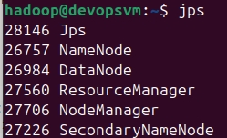

### 3.2 Создание директорий и загрузка данных в HDFS
Структура директорий в HDFS:
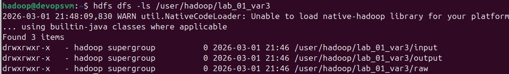

Загрузка CSV в HDFS и проверка наличия файла:
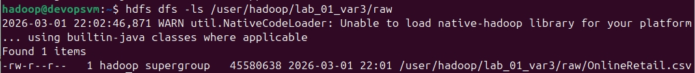

Проверка первых строк файла:
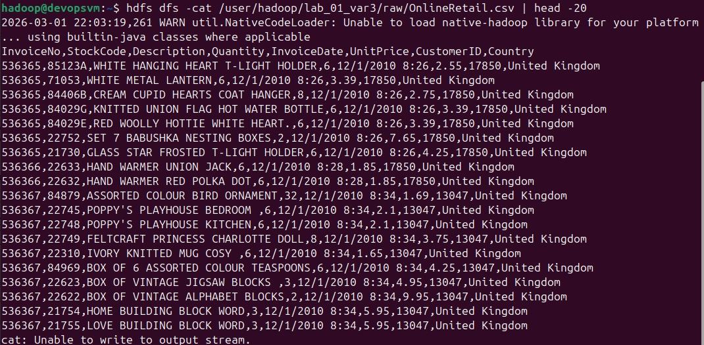

### 3.3 Web UI
HDFS:
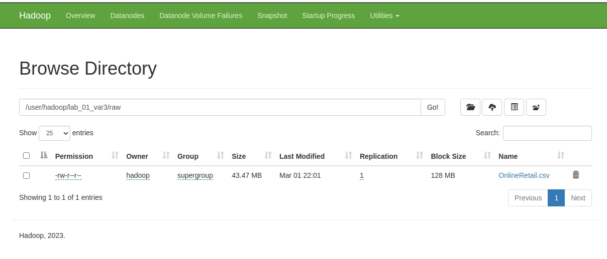

YARN:
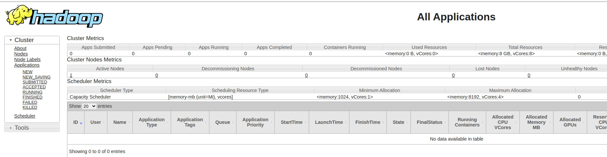

## 4. Загрузка данных в Spark и предобработка

### 4.1 Создание SparkSession
SparkSession создан в JupyterLab. Данные читаются из HDFS по URI вида `hdfs://localhost:9000/...`.

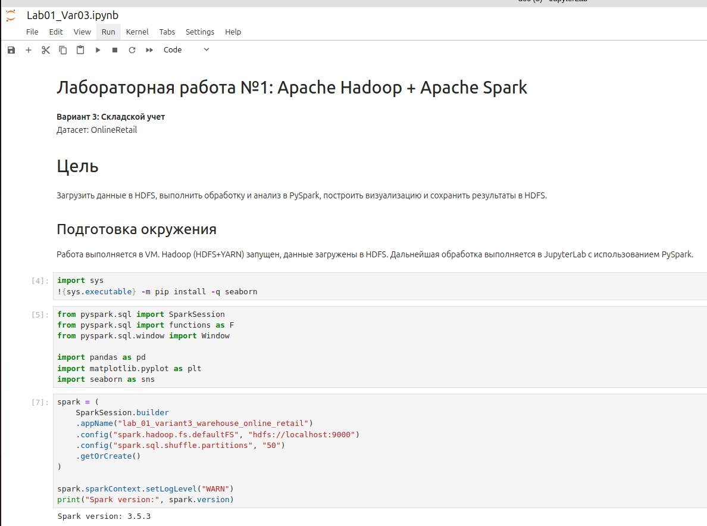

### 4.2 Чтение данных из HDFS в DataFrame
Схема данных, первые строки и количество записей:

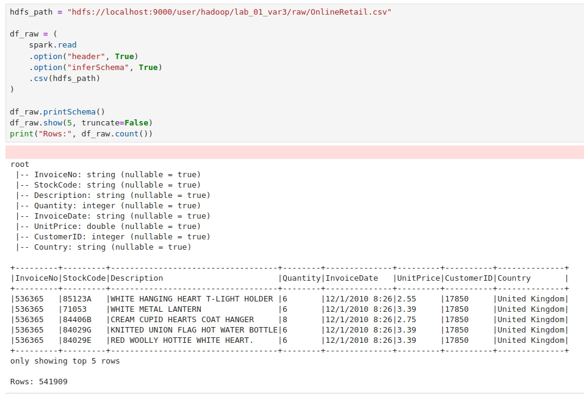

### 4.3 Предобработка данных
Выполнены преобразования:
- `InvoiceDate` приведён к timestamp (`InvoiceTS`);
- удалены строки с некорректными значениями (`UnitPrice <= 0`, `Quantity == 0`) и пустой датой;
- заполнены пропуски `Description`;
- добавлены поля `Revenue = Quantity * UnitPrice` и `MovementType` (SALE/RETURN);
- проверены/удалены полные дубликаты строк (полных дублей не обнаружено).

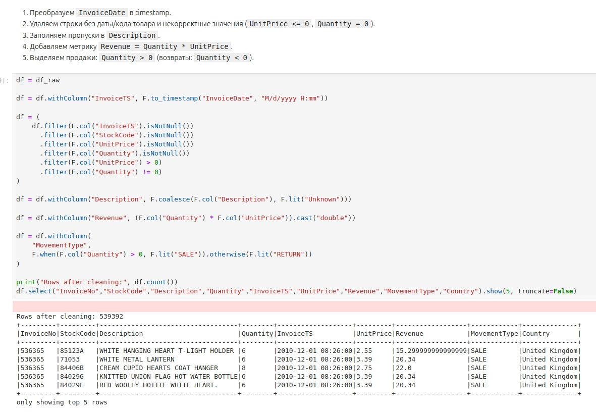
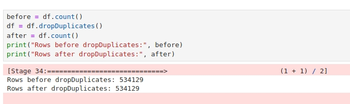

---

## 5. Задание 1 — Неликвидные товары (> 30 дней без продаж)
Неликвид определяется как товар, у которого дата последней **продажи** (SALE) меньше, чем (максимальная дата продаж в данных − 30 дней).

Результат:

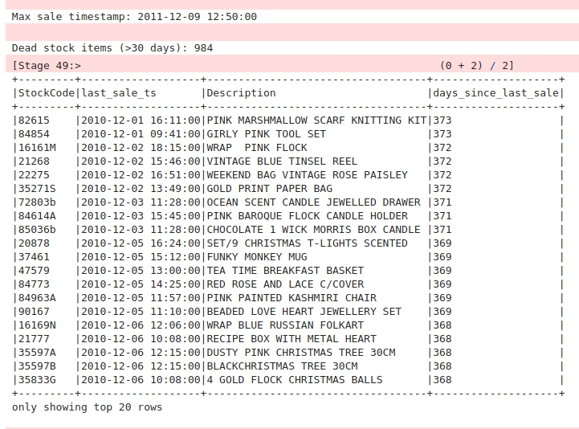

Результат сохранён в HDFS:
- `/user/hadoop/lab_01_var3/output/dead_stock_30d/`

---

## 6. Задание 2 — Spark SQL: критически низкий запас и оборачиваемость

### 6.1 Формирование витрины дневных продаж
Построена витрина `daily_sales` (продажи по дням и товарам): `StockCode`, `SaleDate`, `qty_sold_day`, `rev_day`.

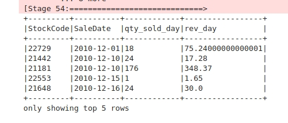

### 6.2 Оценка спроса и точка заказа
Так как в датасете нет реальных остатков, использована модель:
- средний дневной спрос `avg_daily_sales`;
- точка заказа: `reorder_point_qty = avg_daily_sales * lead_time_days`.

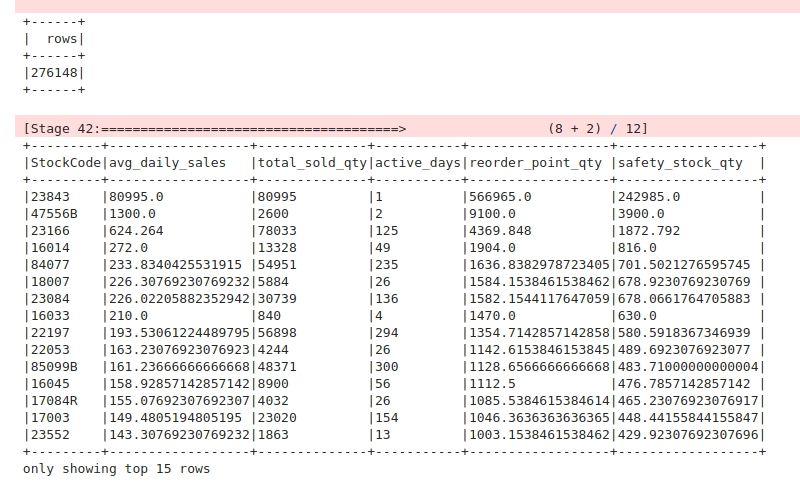

### 6.3 Критически низкий запас и коэффициент оборачиваемости
Использована упрощённая модель:
- `initial_stock_qty = avg_daily_sales * initial_stock_days`;
- `stock_on_hand_qty = initial_stock_qty - total_sold_qty`;
- товар считается критически низким, если `stock_on_hand_qty < reorder_point_qty`;
- оборачиваемость (в штуках): `turnover_qty = total_sold_qty / (initial_stock_qty/2)`.

Результат:

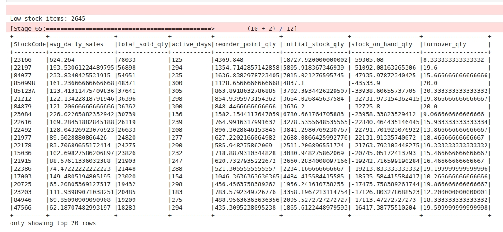

Результат сохранён в HDFS:
- `/user/hadoop/lab_01_var3/output/low_stock/`

---

## 7. Задание 3 — Визуализация: heatmap остатков по категориям

### 7.1 Категоризация товаров (ABC-анализ)
Категории сформированы по выручке:
- A: до 80% накопленной выручки,
- B: до 95%,
- C: остальные.

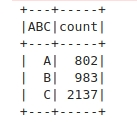

### 7.2 Heatmap
Построена heatmap: количество товаров по ABC-категории и диапазонам модельного остатка (`stock_on_hand_qty` bins).

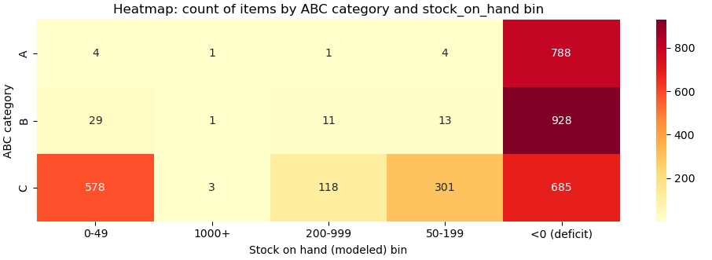

График сохранён в HDFS:
- `/user/hadoop/lab_01_var3/output/plots/heatmap_stock_by_abc.png`

---

## 8. Сохранение результатов в HDFS
Перед записью результатов права на директорию `output` были скорректированы.

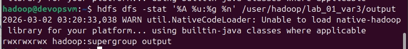

Проверка, что результаты сохранены в HDFS:

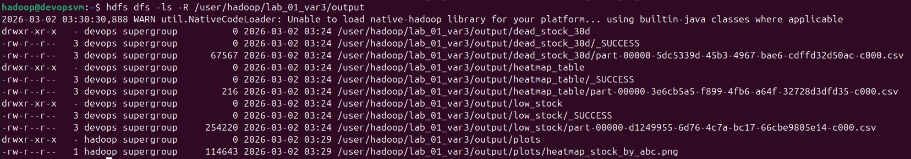
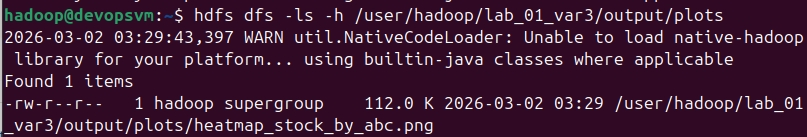

---

## 9. Завершение работы
SparkSession остановлен:

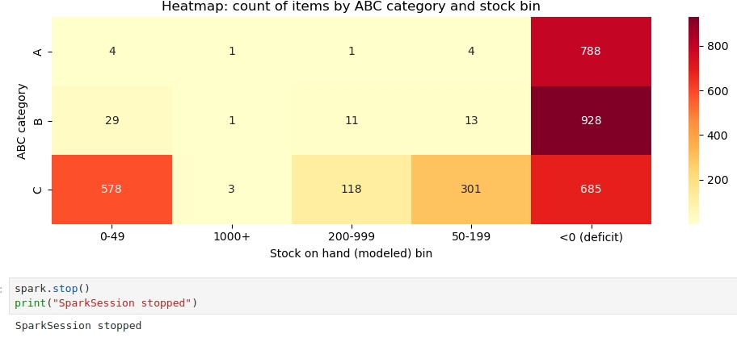

---

## 10. Выводы
- Данные успешно загружены в HDFS и обработаны в Spark.
- Получен список неликвидных товаров (нет продаж более 30 дней).
- В Spark SQL рассчитаны спрос, точка заказа, критически низкий (модельный) запас и коэффициент оборачиваемости.
- Построена heatmap распределения товаров по ABC-категориям и диапазонам модельного остатка; результаты сохранены в HDFS.
