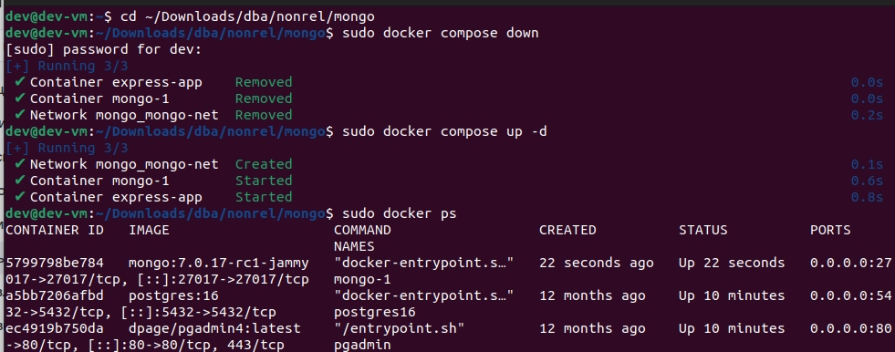
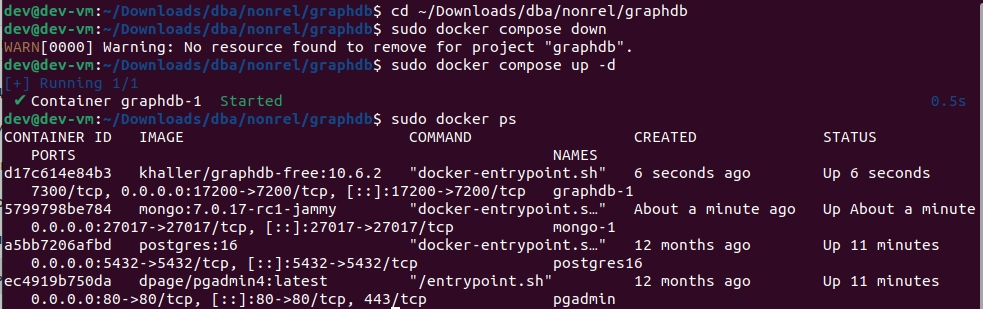
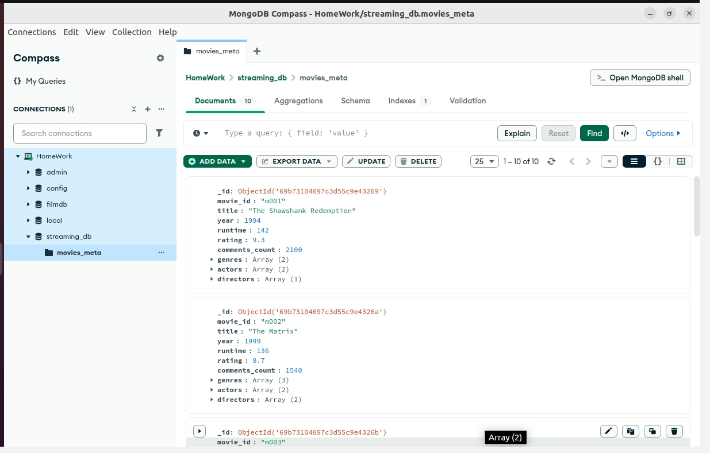
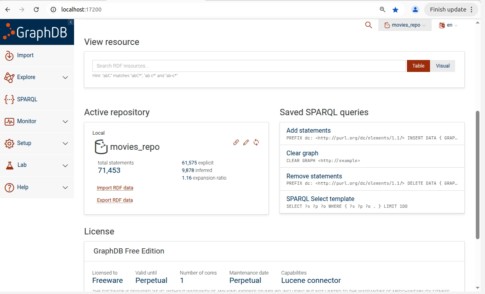
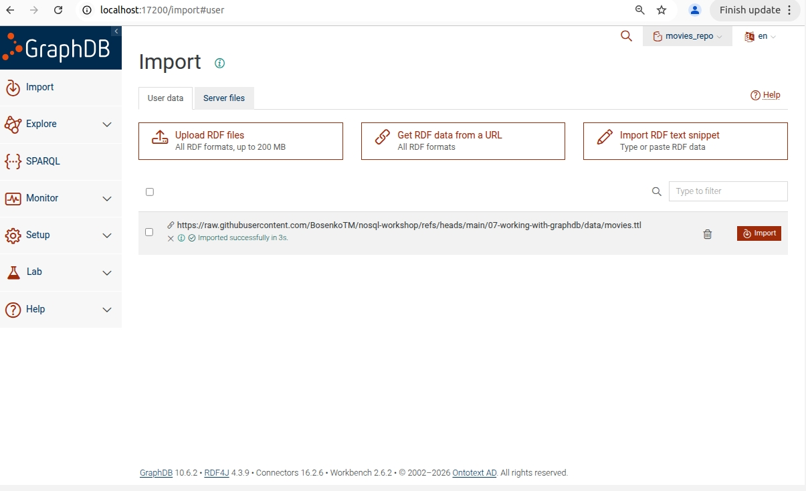
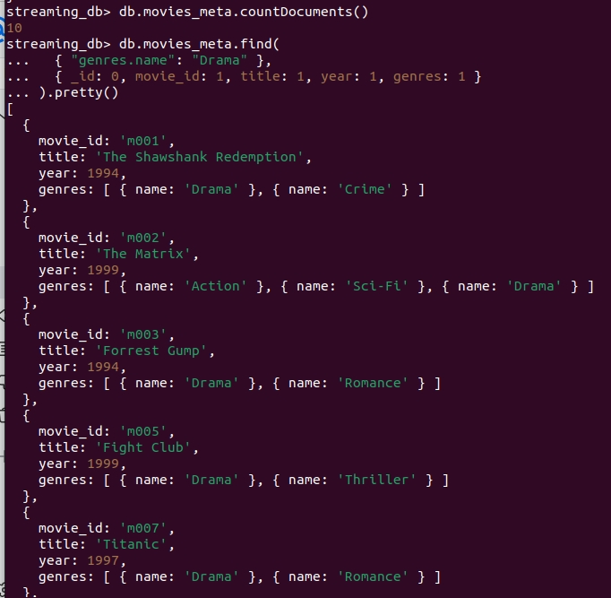
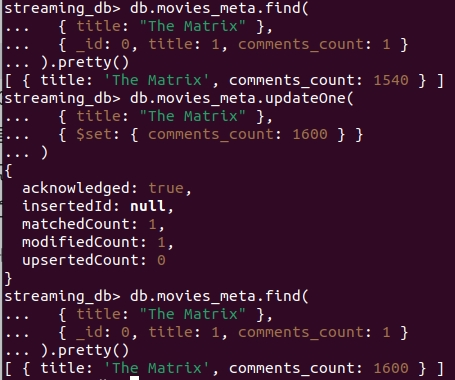

# Отчет по практической работе 2  
## Изучение и применение различных типов NoSQL баз данных на бизнес-кейсах  
Бочков Андрей  
БД251-м  Вариант 3  
  
# Введение  
Целью работы является изучение и применение различных типов NoSQL баз данных в рамках бизнес-кейса.  
В работе используется подход **Polyglot Persistence**, при котором разные типы хранилищ применяются для разных задач.  
  
Используемые технологии:  
-**MongoDB** хранение каталога фильмов и метаданных контента  
-**GraphDB** хранение RDF-графа и выполнение SPARQL-запросов  
-**JupyterLab / Python** визуализация результатов и бизнес-аналитика  
  
Для варианта 3 были поставлены следующие задачи:
1. **MongoDB:** создать коллекцию `movies_meta`, добавить документы с вложенными массивами жанров, найти фильмы с жанром `Drama`.  
2. **GraphDB / SPARQL:** найти фильмы 90-х годов с участием **Keanu Reeves**, отсортированные по количеству комментариев.  
3. **Бизнес-аналитика:** оценить популярность **Keanu Reeves** в 90-е годы по количеству комментариев к его фильмам.  

# Развертывание инфраструктуры  
Работа выполнялась в учебной виртуальной машине с предустановленной Docker-средой.  
Для запуска MongoDB использовался каталог:  
```bash  
cd ~/Downloads/dba/nonrel/mongo  
sudo docker compose down  
sudo docker compose up -d  
```
  
Для запуска GraphDB использовался каталог:  
```bash  
cd ~/Downloads/dba/nonrel/graphdb  
sudo docker compose down  
sudo docker compose up -d    
```  

В ходе выполнения были использованы следующие интерфейсы:  
-MongoDB Compass  
-GraphDB Workbench - http://localhost:17200  
-JupyterLab - http://localhost:8888  

В репозитории приложены фактически использованные файлы запуска среды:  
- docker-compose-mongo.yml  
- docker-compose-graphdb.yml  
  
## Скриншоты развертывания  
### Запуск MongoDB  
  
  
### Запуск GraphDB  
  
  
### Проверка MongoDB через MongoDB Compass  
  
  
### Активный репозиторий GraphDB  
  
  
### Импорт RDF-датасета в GraphDB  
  
  
# Выполнение Задания 1 (MongoDB / NoSQL)  
## 3.1. Выбор модели данных  
Для выполнения задания была использована модель MongoDB.  
В качестве базы хранения создана коллекция `movies_meta`, содержащая документы с информацией о фильмах.  
  
Каждый документ включает:  
-идентификатор фильма  
-название фильма  
-год выхода  
-длительность  
-рейтинг  
-количество комментариев  
-вложенный массив объектов `genres`  
-массивы `actors` и `directors`  
  
Пример структуры документа:  
```json  
{
  "movie_id": "m002",
  "title": "The Matrix",
  "year": 1999,
  "runtime": 136,
  "rating": 8.7,
  "comments_count": 1540,
  "genres": [
    { "name": "Action" },
    { "name": "Sci-Fi" },
    { "name": "Drama" }
  ],
  "actors": [
    { "name": "Keanu Reeves" },
    { "name": "Laurence Fishburne" }
  ],
  "directors": [
    { "name": "Lana Wachowski" },
    { "name": "Lilly Wachowski" }
  ]
}
```

## 3.2. Подключение и создание коллекции  
Подключение к MongoDB выполнялось через оболочку mongosh внутри контейнера:  
```bash  
sudo docker exec -it mongo-1 mongosh -u "root" -p "abc123!"  
```  
  
После подключения была выбрана база данных:  
```JavaScript  
use streaming_db  
```
  
Для работы использовалась коллекция:  
```JavaScript  
db.movies_meta  
```

Перед загрузкой данных коллекция была очищена:  
```JavaScript  
db.movies_meta.drop()  
```

## 3.3. Загрузка документов  
В коллекцию movies_meta были добавлены 10 документов с помощью команды insertMany(...).  
  
После загрузки данных было проверено количество документов:  
```JavaScript  
db.movies_meta.countDocuments()
```
  
Результат:  
в коллекции успешно создано 10 документов  
  
## 3.4. Поиск фильмов с жанром Drama  
Для поиска фильмов с жанром Drama использовался запрос по вложенному полю массива genres:  
```JavaScript  
db.movies_meta.find(
  { "genres.name": "Drama" },
  { _id: 0, movie_id: 1, title: 1, year: 1, genres: 1 }
).pretty()
```  
  
В результате были найдены фильмы:  
- The Shawshank Redemption  
- The Matrix  
- Forrest Gump  
- Fight Club  
- Titanic  
- The Green Mile  
Это подтверждает корректную работу MongoDB со вложенными массивами объектов.


## 3.5. Обновление документа  
Для демонстрации операции обновления был изменён атрибут comments_count у фильма The Matrix.  
Проверка до обновления:
```JavaScript  
db.movies_meta.find(
  { title: "The Matrix" },
  { _id: 0, title: 1, comments_count: 1 }
).pretty()
```
  
Обновление:  
```JavaScript  
db.movies_meta.updateOne(
  { title: "The Matrix" },
  { $set: { comments_count: 1600 } }
)
```
  
Проверка после обновления:  
```JavaScript
db.movies_meta.find(
  { title: "The Matrix" },
  { _id: 0, title: 1, comments_count: 1 }
).pretty()
```
  
Результат:  
- документ найден (matchedCount = 1)  
- документ успешно изменён (modifiedCount = 1)  
  
  
